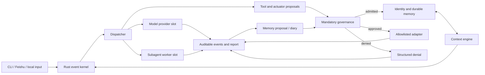

# Architecture

Chuang Agent is a Linux-first local agent operating system. Its stable center is durable identity and memory; models, worker agents, tools, and interfaces are replaceable shells.

## Stable contracts

- Provider: model request/response boundary, including OpenAI-compatible and Anthropic-compatible adapters.
- Memory store and context engine: bounded durable memory, recall, budgeting, and compaction.
- Subagent spawner: isolated workers return reports or memory proposals; they cannot write core memory directly.
- Actuator and control plane: actions are proposed, governed, allowlisted, and then executed.
- Governance: mandatory structured decisions with no silent fallback.
- Evolver: observes failures and proposes reusable rules; the public example config defaults to dry-run.

## Plugin maturity

The current runtime provides traits, configuration-selected built-ins, and command adapters. Plugin manifests are currently checked for declared boundaries; they are not yet a general-purpose dynamic loader. Runtime load/unload, dependency rollback, signature verification, and a versioned third-party SDK remain roadmap items.

## Trust boundaries

1. Secrets enter only through named environment variables and must not be written to config, events, memory, or logs.
2. External sends, destructive actions, account changes, payments, and system/network changes require explicit approval.
3. Real providers, external workers, actuators, control adapters, proactive sends, and automatic evolution are opt-in in the public example.
4. The supported release environment is Linux. Windows native execution is not currently a tested security or compatibility boundary; use WSL2.
